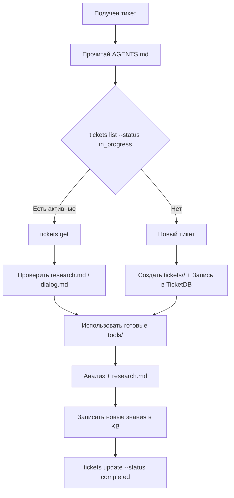

# Правила для AI-агента техподдержки iRidi

> Прочитай этот файл **полностью** перед началом работы над любым тикетом.
> Это обязательный онбординг. Не пропускай разделы.

---

## ⚡ Workflow: первые 5 минут



### Пошаговый чеклист

При старте сессии или при получении нового тикета:

1. **Прочитай** этот файл целиком
2. **Проверь активные тикеты:**
   ```powershell
   python -m tools.ticketdb.cli tickets list --status in_progress
   python -m tools.ticketdb.cli tickets list --status pending
   ```
3. **Если тикет уже есть в БД:**
   ```powershell
   python -m tools.ticketdb.cli tickets get <ticket_id>
   ```
4. **Если тикет новый (нет в БД, нет папки):**
   - Создай папку `tickets/<case_number>/`
   - Создай `tickets/<case_number>/dialog.md` с историей переписки
   - Зарегистрируй в TicketDB:
     ```powershell
     python -m tools.ticketdb.cli tickets add <ticket_id> --status in_progress --product "..." --client-name "..." --summary "..."
     ```
5. **Проверь готовые инструменты** в `tools/` — не пиши свои скрипты, используй:
   - `python tools/omnidesk/fetch_messages.py <case_id>` — получить сообщения
   - `python tools/project/analyze_irpz.py <file.irpz>` — анализ проекта
   - `python tools/image/ocr.py <image> -p monitor` — OCR скриншотов
   - `python tools/pdf/extract.py <file.pdf>` — текст из PDF (+ OCR-фолбэк)
6. **Создай `research.md`** по шаблону `tickets/TEMPLATE/research.md`
7. **Запиши новые знания** в BookStack KB:
   - Найди подходящую книгу в `bookstack_local/shelves/.../books/` или создай локально
   - Отредактируй или создай `.md` файл в нужной главе
   - Выполни `python -m tools.bookstack.sync push`, чтобы загрузить
8. **По окончании:**
   ```powershell
   python -m tools.ticketdb.cli tickets update <ticket_id> --status completed --reply-sent 1
   ```

---

## 🗄️ TicketDB — система управления тикетами и знаниями

**НЕ ХРАНИ статусы тикетов и факты в контексте диалога.** Вся информация в SQLite БД `tools/ticketdb/tickets.db`.

### CLI (для AI)

```powershell
# Тикеты
python -m tools.ticketdb.cli tickets list                          # все
python -m tools.ticketdb.cli tickets list --status in_progress     # активные
python -m tools.ticketdb.cli tickets list --status pending         # ожидающие
python -m tools.ticketdb.cli tickets get 370-346871                # детали
python -m tools.ticketdb.cli tickets add NEW-ID --status in_progress --product "..." --summary "..."
python -m tools.ticketdb.cli tickets update 370-346871 --status completed --reply-sent 1
python -m tools.ticketdb.cli tickets delete 999-888888

# База знаний
python -m tools.ticketdb.cli kb list                               # все факты
python -m tools.ticketdb.cli kb list --category android            # по категории
python -m tools.ticketdb.cli kb list --search padding              # поиск
python -m tools.ticketdb.cli kb create iridi_script aes_padding --value "PKCS7 only for non-aligned" --source "ticket 971"
python -m tools.ticketdb.cli kb update 1 --value "new value"
```

### API (для пользователя)

```
http://127.0.0.1:7987/api/tickets           GET/POST
http://127.0.0.1:7987/api/tickets/{id}      GET/PUT/DELETE
http://127.0.0.1:7987/api/kb                GET/POST
http://127.0.0.1:7987/api/kb/{id}           GET/PUT/DELETE
http://127.0.0.1:7987/api/kb/categories     GET
http://127.0.0.1:7987/docs                  Swagger UI
```

### Web UI (для пользователя)

```
http://127.0.0.1:7988/                       Dashboard
http://127.0.0.1:7988/tickets                List + filters
http://127.0.0.1:7988/tickets/{id}           Detail + edit/delete
http://127.0.0.1:7988/tickets/new            Create ticket
http://127.0.0.1:7988/kb                     KB list + filters
http://127.0.0.1:7988/kb/{id}                Detail + edit/delete
http://127.0.0.1:7988/kb/new                 Create KB entry
```

### Правила работы с TicketDB

1. **При старте сессии:** `python -m tools.ticketdb.cli tickets list --status in_progress`
2. **Новый тикет:** сразу создать запись в БД + папку `tickets/{case_number}/`
3. **Новое знание:** сразу записать в KB (category по домену: `iridi_script`, `android`, `api`, `general`, `integration`)
4. Файлы research.md, reply_draft.txt остаются в `tickets/{id}/`, БД хранит метаданные и пути
5. **По окончании:** `tickets update {id} --status completed --reply-sent 1`

---

## 📋 Research: формат research.md

Каждый тикет должен содержать `research.md` со следующей структурой:

### 1. Вопросы клиента (блок в самом начале)

Перед анализом выпиши **все вопросы клиента** из dialog.md в отдельный блок:

```markdown
## Вопросы клиента

1. **<вопрос>** — L1 ответил: да/нет/частично (что именно сказал)
2. **<вопрос>** — L1 ответил: нет (ожидает ответа)
3. ...
```

### 2. Классификация

Продукт, тип проблемы, уровень (L1/L2), срочность.

### 3. Анализ и ход решения

Факты, что уже сделано, что не работает.

### 4. Альтернативные варианты

Если есть несколько путей решения.

### 5. Следующие шаги

Конкретные действия с приоритетами.

### 6. Ссылки

На документацию, тикеты, внешние ресурсы.

### 7. Дополнительно (если нужно)

Факты, не относящиеся к вопросам клиента, но важные для контекста.

---

## ✅ Фактчекинг перед записью

Перед записью любого утверждения в research.md, dialog.md или баг-репорт — **перечитай исходный диалог и найди точное сообщение клиента, подтверждающее это утверждение**.

### Правила

- **Каждое фактическое утверждение должно иметь ссылку на конкретное сообщение клиента или приложенный файл.**
- Если утверждение нельзя проследить до конкретного источника — оно не должно попадать в документ.
- Не комбинируй факты из разных под-тем, если клиент явно не связывал их.
- После написания черновика — пройдись по каждому предложению и проверь: "Откуда я это взял? Клиент это говорил, или я сам додумал?"
- **Не додумывай ожидаемое поведение.** Если в баг-репорте нужно описать «ожидаемое поведение» — формулируй строго как «должно работать согласно настройкам проекта/документации». Не пиши «должен сохранять состояние» — это интерпретация.
- **Ссылайся на документацию в баг-репортах.** Добавь блок `> Ссылка на документацию:` с URL и цитатой.

---

## 🛠️ Инструменты (tools/)

Перед тем как писать любой код — проверь, нет ли готового инструмента в `tools/`.

| Категория | Инструмент | Назначение |
|-----------|-----------|------------|
| **Omnidesk API** | `tools/omnidesk/fetch_messages.py` | Получить все сообщения тикета по internal case ID |
| | `tools/omnidesk/download_attachments.py` | Скачать все вложения + inline-изображения из тикета. `--ocr` для распознавания |
| **Анализ проектов** | `tools/project/analyze_irpz.py` | Распарсить .irpz: страницы, попапы, токены, скрипты |
| **PDF** | `tools/pdf/extract.py` | Извлечение текста из PDF (PyMuPDF + OCR-фолбэк) |
| **OCR** | `tools/image/ocr.py` | Текст из скриншотов / фото мониторов (3 engine: tesseract, easyocr, web) |
| **JS-паттерны** | `tools/script-patterns/*.js` | Готовые решения для Dynamic List, Token Bus, Sine Gen |
| **BookStack** | `tools/bookstack/sync.py` | Двусторонняя синхронизация BookStack ↔ `bookstack_local/` |
| | `tools/bookstack/migrate_kb.py` | Миграция старых KB записей в BookStack |

Подробности: `tools/README.md`.

---

## 📁 Структура тикета на диске

```
tickets/<case_number>/
├── research.md          # Анализ: вопросы клиента, классификация, корневые причины, рекомендации
├── dialog.md            # История переписки с таймштампами
├── files/               # Вложения, скрипты, тестовые проекты
│   ├── convert_*.py     # Вспомогательные скрипты для скачивания клиентом
│   ├── ocr_*.txt        # Результаты OCR
│   └── ...
├── reply_draft.txt      # Черновик ответа (опционально)
├── bug_report_*.md      # Баг-репорты для Redmine (опционально)
└── temp/                # Черновики и артефакты (опционально)
```

Шаблон: `tickets/TEMPLATE/`

---

## 📚 BookStack — база знаний (KB)

**URL:** http://bookstack.mytunnel.org
**Локальная копия:** `bookstack_local/` (синхронизируй перед работой)

### Правила

1. **🚫 НИКОГДА не удаляй чужие статьи.**
2. **Всегда работай через локальную копию.** Не пиши напрямую в BookStack.
3. **Новое знание → сразу в BookStack.** Не храни в контексте.
4. **Push только своих изменений.** Pull перед началом работы.

### Синхронизация

```powershell
python -m tools.bookstack.sync pull      # скачать всё из BookStack в bookstack_local/
python -m tools.bookstack.sync push      # загрузить локальные изменения в BookStack
python -m tools.bookstack.sync status    # показать расхождения
```

### Структура локальной копии

```
bookstack_local/
└── shelves/<shelf_slug>/
    └── books/<book_slug>/
        ├── book.json              # метаданные книги
        └── chapters/<chapter_slug>/
            ├── chapter.json       # метаданные главы
            └── pages/<page_slug>.md  # страница в Markdown
```

AI-агент читает `.md` файлы, редактирует их, потом делает `push`.

### Работа с API (если нужно напрямую)

```powershell
python -m tools.bookstack.client                    # вспомогательные функции
python -m tools.bookstack.migrate_kb                # миграция старых KB
python -m tools.bookstack.migrate_kb --apply        # (с исполнением)
```

---

## 📜 Специфичные правила по продуктам

### Скриптинг в iRidi Studio

Перед написанием JS-скрипта **ОБЯЗАТЕЛЬНО** сверься с `knowledge_base/iridi_script_api.md`.

**Ключевые ограничения (самые частые ошибки):**

- **НЕТ** `setTimeout()` — используй `IR.SetTimeout(ms, fn)`
- **НЕТ** `setInterval()` — используй `IR.SetInterval(ms, fn)`
- **НЕТ** стрелочных функций — используй `function() {}`
- **НЕТ** `let`/`const` — используй `var`
- **НЕТ** `JSON.parse`/`JSON.stringify`
- **НЕТ** `console.log` — используй `IR.Log()`
- **Server Tags:** чтение через `IR.GetVariable("Server.Tags.*")`, запись ТОЛЬКО через `IR.GetServer().Set()`
- **🚨 НИКОГДА** `parseFloat(IR.GetVariable(...)) || default` — при токене `0` сбросит на default. Используй `isNaN()`.

### AES через IR.CreateEncryption

См. `tickets/971-734230/files/aes_padding_test.js` и раздел в `tickets/971-734230/research.md`.

- iRidi дополняет данные до 16 байт, но только если нужно (не PKCS7).
- Ручной PKCS7 перед `.Encode()` — правильный подход.
- `.Decode()` стриппит PKCS7 автоматически.
- `IR.CalculateHash` принимает Array как аргумент.

### OCR распознавание скриншотов

Если в тикете есть вложения-изображения (jpg/png):

1. Запусти `tools/image/ocr.py` на каждом изображении
2. `-p monitor` для фото мониторов, `-p screenshot` для скриншотов
3. Сохрани результат в `files/ocr_{image_name}.txt`
4. Если не распозналось — попробуй другой engine (`--engine tesseract` / `--engine easyocr` / `--engine web`)
5. Если OCR не дал результата — опиши содержимое изображения средствами модели
