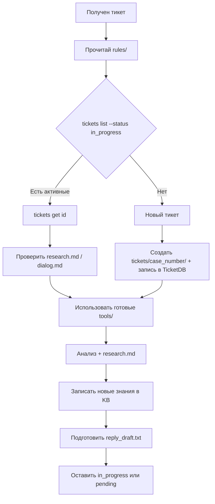

# Workflow: первые 5 минут

> Прочитай [README.md](README.md) и все файлы `rules/` перед началом работы над тикетом.

## Диаграмма



## Пошаговый чеклист

При старте сессии или при получении нового тикета:

1. **Прочитай** все файлы из `rules/` (см. [README.md](README.md))
2. **Проверь активные тикеты:**
   ```powershell
   python -m tools.ticketdb.cli tickets list --status in_progress
   python -m tools.ticketdb.cli tickets list --status pending
   ```
3. **Если тикет уже есть в БД:**
   ```powershell
   python -m tools.ticketdb.cli tickets get <ticket_id>
   ```
4. **Если тикет новый (нет в БД, нет папки):**
   - Создай папку `tickets/<case_number>/`
   - Создай `tickets/<case_number>/dialog.md` с историей переписки
   - Зарегистрируй в TicketDB:
     ```powershell
     python -m tools.ticketdb.cli tickets add <ticket_id> --status in_progress --product "..." --client-name "..." --summary "..."
     ```
5. **Проверь готовые инструменты** в `tools/` — см. [05-tools.md](05-tools.md)
6. **Создай `research.md`** по шаблону — см. [03-research-format.md](03-research-format.md)
7. **Запиши новые знания** в BookStack KB — см. [07-bookstack.md](07-bookstack.md)
8. **По окончании работы:**
   - Подготовь черновик в `tickets/<id>/reply_draft.txt`
   - Оставь статус `in_progress` или `pending`
   - **Не ставь `completed`** — см. [08-critical.md](08-critical.md)
